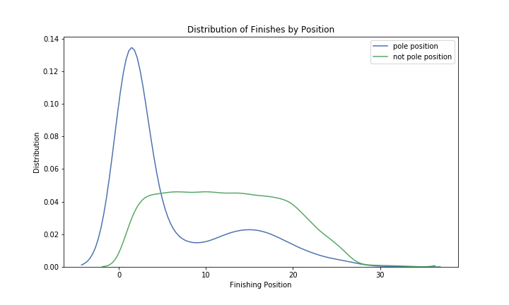
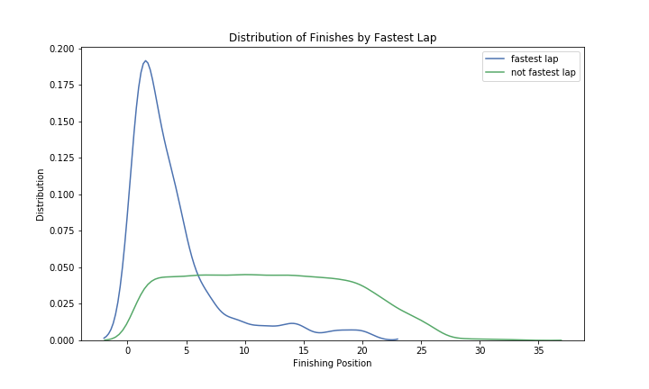
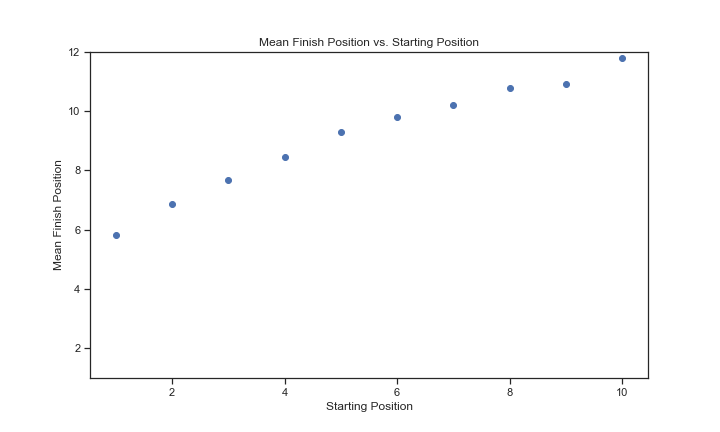

# Formula 1 Exploration

For this capstone project, using a Formula 1 Racing dataset from 1950-present, different aspects will be compared in regards to race success. 

## Background

Formula racing is a widely popular form of motosport road racing. It requires the chassis and engines of the cars to adhere to a set of specifications, but in open formula racing, a team is allowed to choose or design the chassis and/or engine to fit said specifications. 

## Dataset

The dataset came from Ergast which is a public API. There were SQL database dumps provided, which contained 13 data frames correlating with the entirety of the history of Formula 1 Racing. 

* Circuits
* Constructor Results
* Constructors
* Driver Standings
* Drivers
* Lap Times
* Pit Stops
* Qualifying
* Races
* Results
* Seasons
* Status

http://ergast.com/mrd/db

## Questions

What makes for a successful driver? What is more important, the sitting pole position, or the overall fastest race lap?

Before every race, drivers must run laps in the qualifying stage. The fastest lap in the qualifying stage determines their starting position for the actual race. While there is no silverware involved with polesitting (fastest qualifying time), is there an inherent advantage to starting first? 

During every actual race, each drivers fastest lap times are compared to each other. While similar to how they are calculated during the qualfying stage, the stakes are very different in an in-race scenario. (In the qualifying period, not all dirvers are timing their qualifying laps at the same time, constantly pit stopping to change their tires and to make adjustments. In the actual race, all the drivers are driving at full speed.) The fastest lap is awarded with a bonus point in the overal drivers' and constructors' championship. Is there an an advantege to winning the fastest lap?

## Data Analysis
The EDA on the data was performed primarily using Jupyter Notebooks. There were fatal errors that occured while using the provided SQL files. The alternative csv files were available for download which proved to be much more successful.

While analyzing what aspects of a race affect the outcomes the most, it was determined that the results.csv data table would be the most useful. Columns that were initially very useful were 'grid', 'rank', and 'positionOrder'. The table was masked to analyze the different parameters (e.g. 2nd starting position, or 4th fastest lap time) that were to be analyzed. 

The starting position for each driver is indicated by the value in the 'grid' column, in ascending rank (1 is the polesitter, or faster qualifier).

The finishing positiong for each driver is indicated by the value in the 'positionOrder' column. As not all drivers finish the race, the 'positionOrder' is usually determined after the race by the positioning of the rest of the drivers, and how early some drivers retired early (usually due to collisions or other car/engine problems)

The fastest lap time for each driver and it's ranking amongst all the other driver's fastest lap times is indicated by the column 'rank'.

  

A heatmap was created to show the density of finsihing positions in terms of starting positions('grid').

There seems to be a slight positive correlation for the starting position and the finishing position.

The starting positions were masked and plotted against each other.

The fastest lap times were masked and plotted against each other.

The distribution of finishing positions appears to be left skewed in both analyses for starting positions and fastest lap times. 

The mean finishing position in terms of starting position was also plotted.

## Correlation Testing:
### Test 1: Pole position
H0: There is no relationship between starting position and finishing position.

Ha: There is a relationship between starting positiong and finishing position.

The statistical test that was used was a Spearman Correlation Test.

Type | Value
---------|----------
 corr | 0.442 
 pvalue | 0.0

The p-value returned was 0.0 which can be assummed that the value was very, very low, and coupled with a moderate correlation of .442, the null hypothesis can be rejected.

### Test 2: Fastest lap time
H0: There is no relationship between fastest lap time and finishing position.

Ha: There is a relationship between fastest lap time and finishing position.

The statistical test is again a Spearman Correlation Test.

Type | Value
---------|----------
 corr | 0.0618
 pvalue | 5.245E-21

 While the p-value for this test is very low, the correlation of the rank and finishing position is also very low (< 0.1). There is a very weak correlation of the two values and the null hypothesis cannot be rejected.

 Further testing: 
 A pearson correlation test was performed on the mean values of the finish position in regards to the starting position.

 Type | Value
---------|----------
 corr | 0.986
 pvalue | 1.503E-07

## Discussion/Further Analysis
Upon further research, the reasoning behind the fastest individual lap time not correlating with the overall success of the finsihing positiong, can be attributed to the fact that only the fastest lap of each driver is taken per race. The conditions of each lap are never the same. There are a myriad of factors that could have affected the driver during the moment they achieved the fastest lap (e.g. racing from behind, faster start lap speed, good tire management, headwind/tailwind or lackthereof, weather)

While the driver with the most fast individual lap times(more consistency) is mathematically more inclined to win the race, the fastest overall lap is not stastically favored.

## Conclusion
The fastest qualifying lap proved to a strong indicator for success in a given F1 race. The null hypothesis of the pole position not having any effect on a race can be rejected. 

The fastest raceday lap cannot be used as an indicator for success in a given F1 race. The null hypothesis of fastest lap not having any effect on a race cannot be rejected.

## Further Research

The goals are to determine what resources and factors increase or decrease the likelihood of winning a F1 race. Some of the other factors to examine are engine manufacturers, chassis manufacturers, home country track advantage, driver age, among many others.

